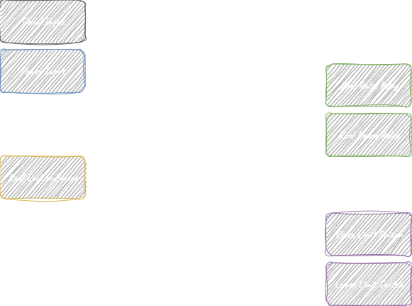
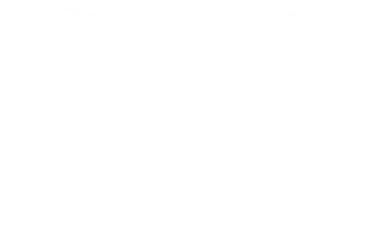
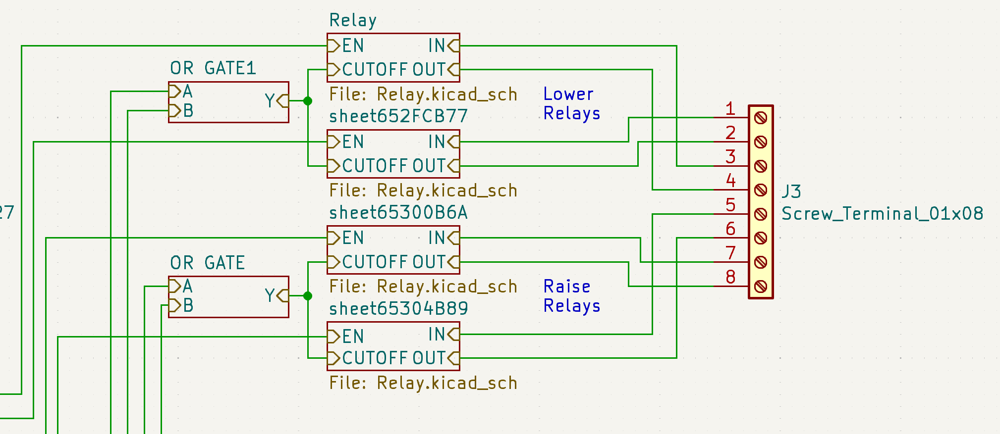
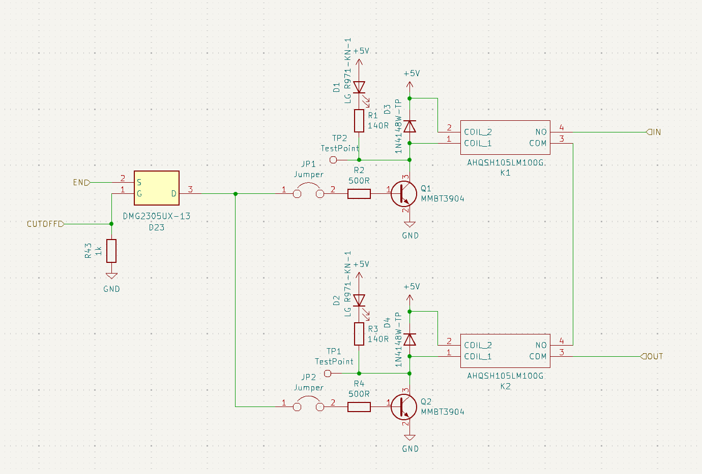
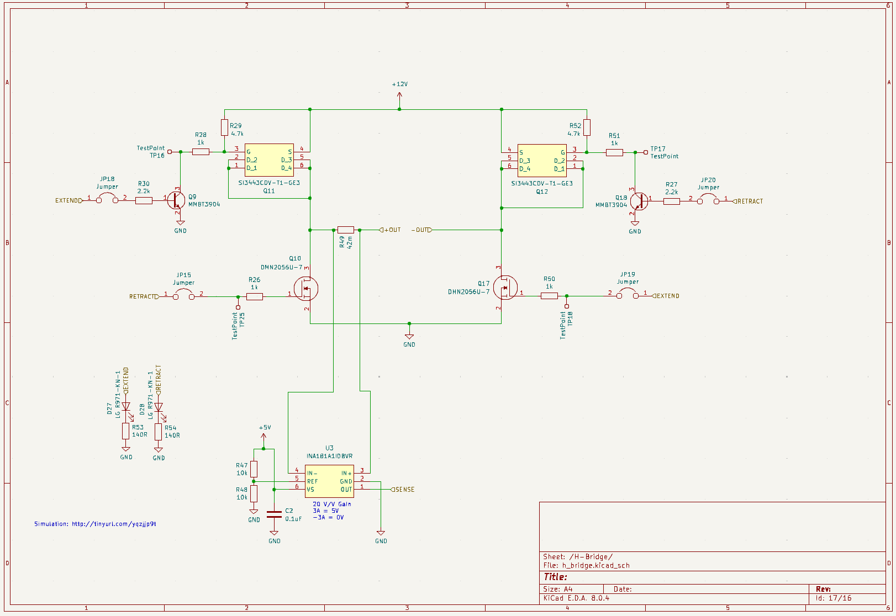
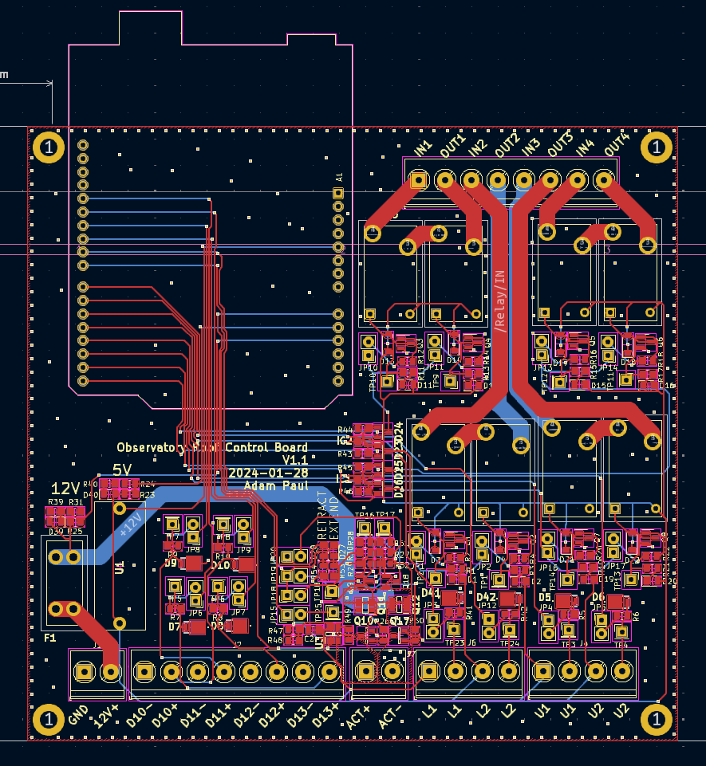
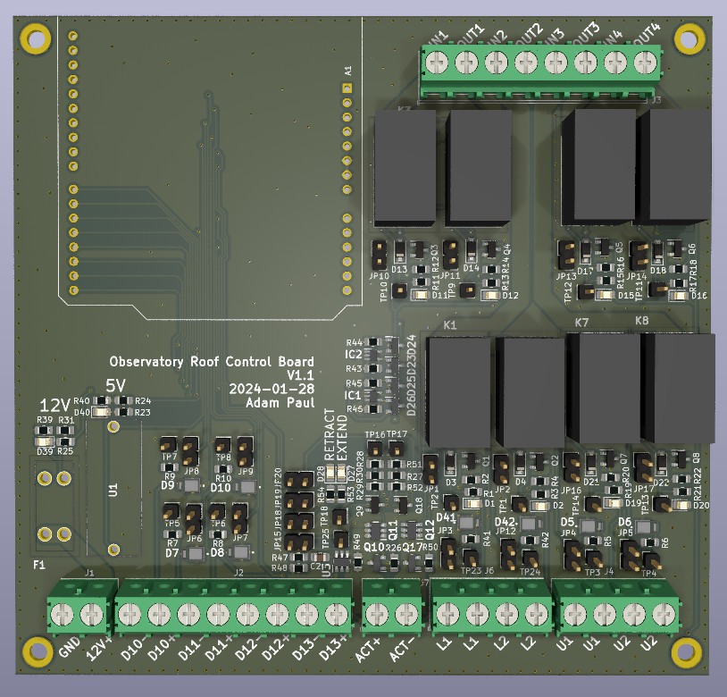
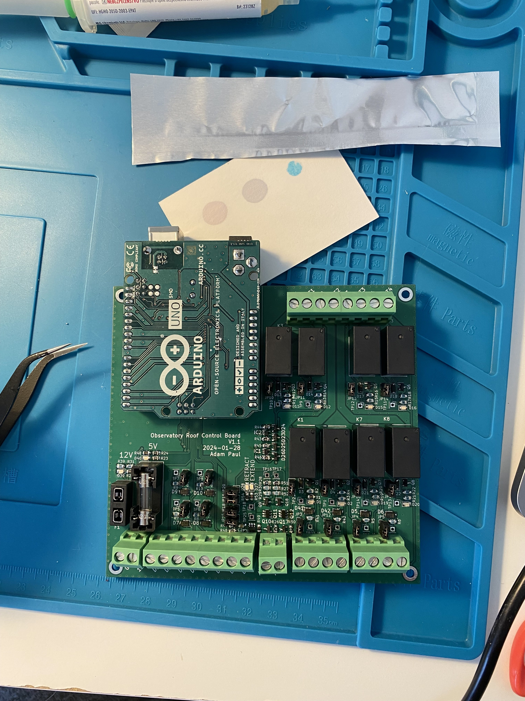
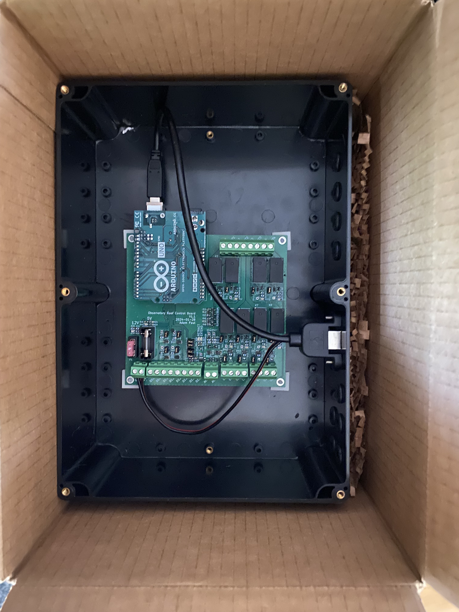
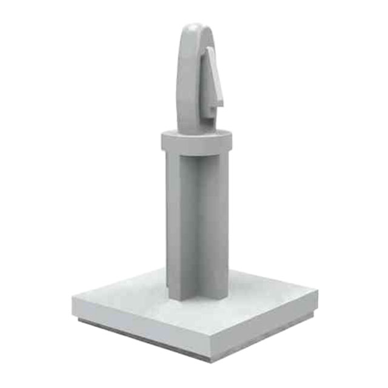

From the very beginning, the goal for this observatory was full automation.

Remote operation was always a core part of the plan, so I knew I needed to automate both the roof and the telescope. The roof was already operated using an electric hoist, so the core functionality was in place. The challenge was to adapt the system for remote control. My solution involved designing a controller to interface with the hoist's hand controller. By shorting the appropriate contacts, I could make the roof move up or down on command. Once this controller was built, I connected it to the observatory's server computer via a serial interface. This setup allowed me to control the roof remotely through software.

With the roof automation complete, I would have the foundation for a fully remote observatory—turning the initial vision into reality.

## Design

The most important criteria I had with this design was to ensure that the controller did not break anything when raising the roof. A flaw with my design was that when the roof is in the closed position it presses up against the wall of the observatory. If the hoist continues to operate when the roof is fully closed, it could result in catastrophic damage—such as snapping the hoist cable, damaging the roof structure, or compromising the observatory walls. Clearly, these are outcomes that must be avoided at all costs. You will see throughout the design multiple places where redundancy was added and thought put into making sure that the roof does not exceed its limits.

The overall design for the controller is as follows

The controller features relays to control the hoist for raising and lowering, limit switches to detect the position of the roof, and a linear actuator to move a lock into place when the roof is closed. This is all tied together with an arduino that controls all the subsystems and provides a serial interface for remote control. The entire schematic can be found here (https://github.com/pauladam316/observatory_pcbs/tree/main/TelescopeController), with some interesting elements discussed below

### Hoist Control
To raise and lower the roof, the controller needs to short the contacts in the hand controller to mimic the buttons being pressed. I chose this approach as it allowed the buttons in the hand controller to still function for manual control, and ensured that the built-in emergency stop was still functional. The switch has 6 contacts that short together in the following ways

to trigger this, a relay circuit was designed that would short the upper two contacts for raising, and the lower two for lowering

Mechanical relays were used to provide electrical isolation from the controller as it uses 120VAC. The relays used were also quite cheap compared to alternatives, and space was not a constraint. Two relays are used in series per channel in case a relay fails closed to ensure that it doesn't trigger the roof raise.

4 limit switches are used to detect the roof position, two at the top to detect raising and two at the bottom to detect lowering. Two switches are used for redunancy in either the switch failing or becoming misaligned. The switches are read by the Arduino so the software can stop commanding the raise/lower, but are also wired in hardware to directly disable the relays via the OR gate seen above.

### Lock

The roof control features an automated lock that holds the roof in place while in the raised position. It features a wood bar that rotates into place to lock onto the roof, and a linear actuator to rotate it. The chosen actuator can't hold a lot of weight, so care was taken to ensure that the lock was perfectly parallel with the direction of motion of the roof to ensure that when in use, little to no load was transferred to the actuator. 

<video src="IMG_7991.MOV" width="50%" controls></video>

The lock circuit is as follows

The circuit is a basic H-bridge with current sense, allowing for current to flow forwards or backwards through the actuator to raise/lower. The current sense is used to determine when the limit switch hits either end of its travel.

## Build

When laying out the board, care was put into keeping the AC circuitry separate from the rest of the design, and planning out the system such that the AC cabling could be kept away from the DC signal wires.

The enclosure for this board was very basic, just a plastic box with holes for the wiring. One cool thing I did find for this project though were these adhesive backed standoffs for mounting the board.

  

These allowed me to do away with trying to measure and align standoff holes and instead just stick them into place. I will be using these in future builds.

With the board complete I shipped it off to the observatory for install!

## Firmware

The firmware for the controller is quite simple. There is a main loop that continously sends controller telemetry over serial and monitors for commands. Telemetry is sent in packets that contain 3 sync bytes and a payload consisting of readings from all sensors. Commands are also sent with 3 sync bytes followed by a command byte. Commands can tell the controller to open/close the roof and open/close the lock. There is also a heartbeat command that must be sent continuously to the controller. If the heartbeat is missed the controller assumes that communication was lost and stops the roof from moving.

The code for the controller can be found here: https://github.com/pauladam316/roof-control-fw/tree/main

## Lessons Learned

The install itself went very smoothly and had no real issues. With this controller in place I can now automatically open and close the roof without issue. Some thoughts after finishing this part of the project:
- This board could have been made way smaller. swapping the Arduino with a small MCU directly on the board, replacing the mechanical relays and using a smaller connector form factor could have shrunk the footprint, although given that this was being installed on a shelf footprint size wasn't that concerning to me.
- The redundant relay circuit for driving the hoist is probably a bit overkill.
- I ended up really disliking the look of the enclosure. It doesn't matter that much because it isn't seen, but its big and ugly. If I were to do this again, I'd 3D print one and replace the screw terminals with proper connectors built into the side of the enclosure. It makes for a much more satisfying design.
