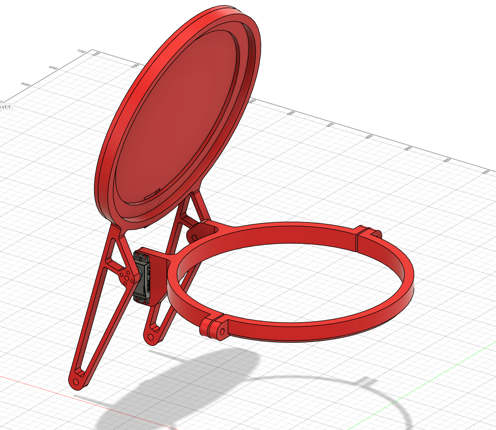
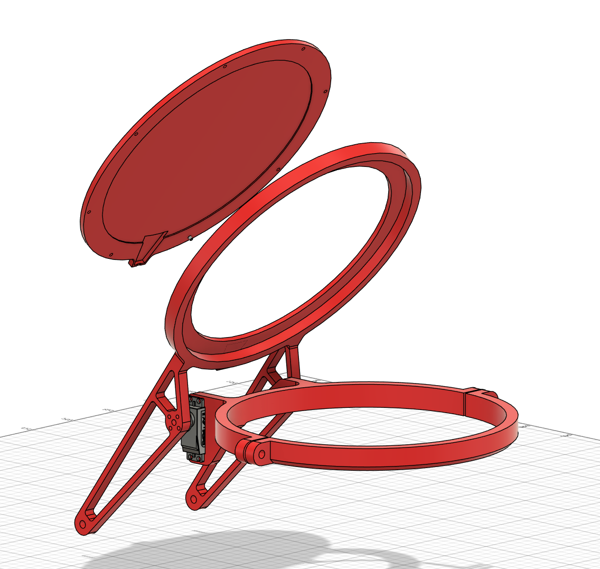
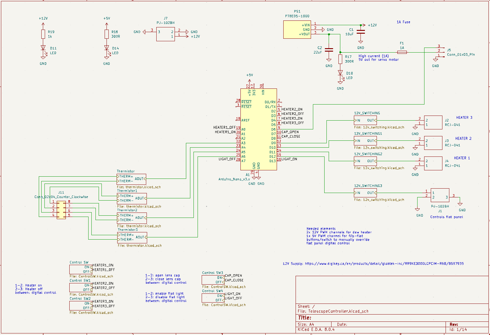
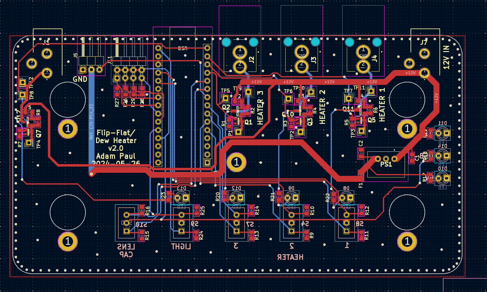
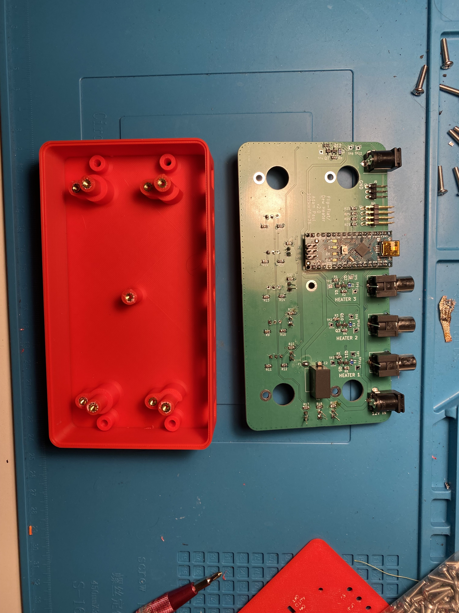
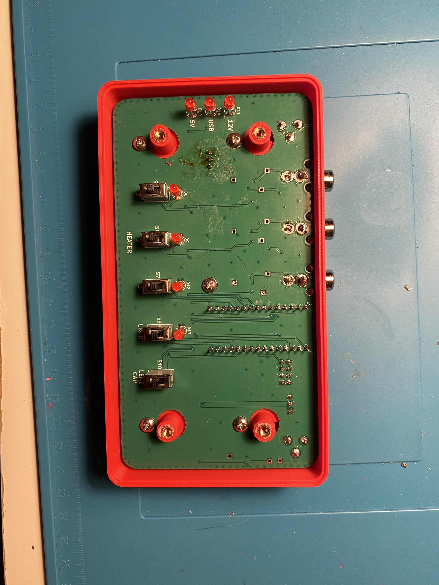
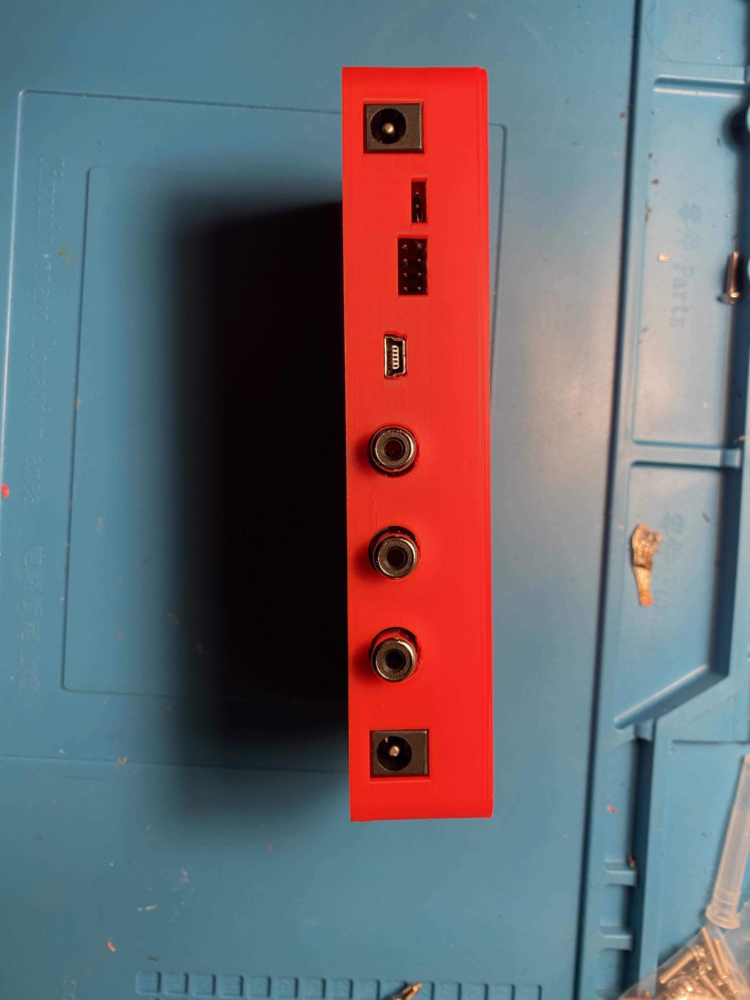
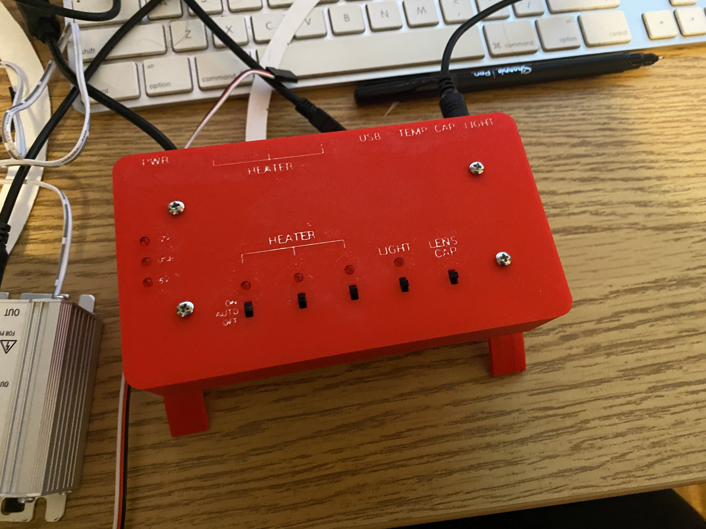

The last step in getting the observatory fully automated was automating the telescope. There are a few parts to this:
- **Telescope Movement:** This is already automated. The telescope is on a motorized mount that allows remote control over serial to point the telescope
- **Lens Cap:** the telescope needs a lens cap to keep dust off the mirrors. It should automatically open and close
- **Dew:** Without a dew management system, dew will accumulate on mirrors overnight and ruin the image

## The Dews and Dont's of Dew
In working on this project I learned a lot about dew. Dew forms on telescope mirrors when the surface of the mirror drops below the dew point, which is always below ambient temperature but varies with humidity. If humidity is high, the dew point is only a degree or two below the ambient temperature. By radiating their heat away into space, the telescope mirrors can actually drop their temperature below ambient and accumulate dew. The easiest way to keep the mirrors above the dew point is to add heating coils to the back of the mirror.

I used heaters from kendrick astro: https://www.kendrickastro.com/. They were well recommended and well priced, and worked great for my needs. The controllers they sell are not automatic though, so I decided to incorporate the heaters into my own controller.

## Lens Cap

The automatic lens cap actually serves three purposes: it is a dust cover, a tool for taking dark frames, and a tool for taking flat frames.
- **Dark frames** are captured by covering the telescopes lens and capturing images with the same exposure settings as your normal captures. This creates an image of the cameras thermal noise pattern.
- **Flat frames** involve capturing an image of an evenly illuminated surface to correct for vignetting, dust shadows, and pixel sensitivity variations in the telescope's imaging system.  

A more detailed explaination of these calibration frames can be found here: https://www.highpointscientific.com/astronomy-hub/post/astro-photography-guides/understanding-calibration-frames.

The design was fairly simple and resembles the lid of a trash can. A clamp band goes around the rim of the telescope to attach the lens cap and a servo motor rotates the lens cap in and out of position. I added long arms to the lens cap itself to give myself the option of adding a counterweight. I was worried with the size of the lens cap that the servo would struggle with the weight, however after building and testing I found this to be a non-issue and no counterweight was added. 

To allow this to serve as a tool for flat calibration, I added this light panel: https://ellumiglow.com/products/astrophotography-8-circle-el-panel-kit?srsltid=AfmBOoqj6Dde2Gly1rHc1_b-_O5rJkbO1W3IZhffkibcdp4ffbqvCx-y. The lens cap has two pieces that sandwich the panel between them. When the lens cap is closed, the light panel can be turned on and flat frames can be captured

To capture dark frames with the lens cap, I can just capture images with the cap closed and the flat light off. I added camera light seal foam around the ring that secures it to the telescope, as well as on the lens cap itself to ensure no light leaks in.

## Controller
### Hardware
*PCB github: https://github.com/pauladam316/observatory_pcbs*  

Both the dew heaters and lens cap need a controller to operate them, and since this is a remote observatory I wanted the ability to remotely control both of them. The controller I designed for this uses an arduino to provide a driver interface to my remote control software and has circuits for heater, lens cap, and flat light control. It also features 3-position switches that serve as manual overrides for each of these elements. Using the switches, the systems can either be manually off, manually on, or remotely controlled. 

### Software
*Firmware Github: https://github.com/pauladam316/telescope-control-fw*  

The controller runs a relatively simple control loop that communicates with the remote control software over a serial connection. The firmware sends telemetry packets and receives command packets, which can be used to control heaters, activate flat lights, or open the lens cap.

While lens cap and light control are very straightforward, the heater control has some control logic behind it. In order to keep dew off the lenses we want to keep the mirrors above the dew point which varies depending on humidity but is never greater than ambient temperature. The heater control loop prevents dew formation by maintaining the mirrors temperature a few degrees above ambient. Each mirror has a thermistor for temperature sensing, along with an additional thermistor to measure ambient temperature. When the heater is enabled, a hysteresis-based control algorithm turns it on only when the mirror temperature drops to within 2°C of the ambient temperature. Once the mirror temperature rises sufficiently above this threshold, the heater turns off.

### Enclosure
I wanted the controller to mount directly to the telescope to simplify the wiring, and I wanted it to look cool. I created a 3d printed enclosure with a front panel that exposes the switches and LEDs from the PCB, and a back panel with cutouts for all the board connectors. I used a wax pen to fill in the labels, with mixed success. The lettering was too small in places to print and fill in properly with the pen.

## Integration
I made a trip out to the observatory to install the new hardware onto the telescope and found almost no issues during integration and testing. The heaters kept the mirrors dew free and the lens cap fit perfectly.

<video src="telescope-controller-integration.MOV" width="50%" controls></video>

Overall I was really happy with how this project turned out. My biggest regret while working on this was that I didn't buy a 3d printer until after the project was complete. I ended up having friends print all the parts for the design, which meant I was much more reluctant to iterate on the design once it had been printed. If I had a chance to do a second revision I could have fixed some of the printing issues with the wax pen and would have likely removed the counterweight arms from the lens cap.
